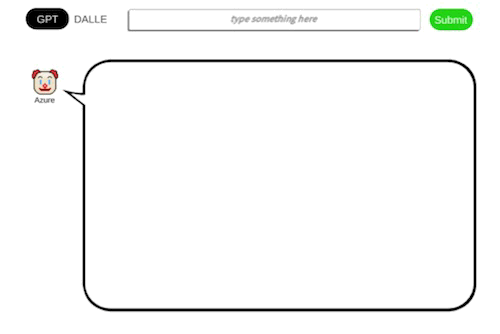

# 🤔 What is this?
This Unity project is a simple tool to use [Azure OpenAI Service API](https://azure.microsoft.com/en-us/products/ai-services/openai-service) and [OpenAI API](https://openai.com) to generate text (GPT) and images (DALLE).  
  

# 💨 What you need to get started
- OpenAI API key  
- Azure OpenAI Service API key  
- Azure OpenAI Service API instance name  
- Unity 2021.3.15 or later  
- Huge Curiosity

※ It is possible to use only one of the APIs. For example, to use only the OpenAI API, the Azure API key and endpoint URL fields can be left blank.  

# 🕵️‍♂️ How to set up
1. Open the project in Unity.  
2. Open the scene `GPT and DALLE`.  
3. Select the `EventSystem` game object in the hierarchy.  
4. Enter the API key and endpoint url in the following fields.  
  - Api Key Azure  
  - Instance Name Azure  
  - Api Key OpenAI  
  In the following capture, `Instance Name Azure` is "docs-test-001" and `Api Key Azure` is "KEY 1" or "KEY 2".  
    
5. (optional) modify parameters for GPT and change the font of `Canvas > Response UI > UI GPT > Text` to make your project compatible with your language. Also change the values of `Max Tokens` and `Memorable Pairs` in the `EventSystem` game object. `Max Tokens` is the maximum number of tokens allowed for the generated answer. `Memorable Pairs` is the number of pairs of `user` and `assistant` conversations. if you set it 0, the conversation will be one-way. if you set it above 0, the conversation will be two-way.  

# 👩‍💻 How to use the UI
Just type the text you want to generate in the input field and press the submit button. If you select the `GPT` tab, you can generate text. If you select the `DALLE` tab, you can generate an image.  
You can also change the API service (`Azure OpenAI Service` or `OpenAI`) by pressing the `clown` emoji button.  

# 👀 Dependencies
The versions of the APIs used are as follows.  
(You can change the versions of them.)  

| API | Version |
| --- | --- |
| Azure GPT | 2023-05-15 |
| Azure DALLE | 2023-06-01-preview |
| OpenAI GPT | gpt-3.5-turbo |

# 📕 Asset packages and references
- [Free emojis pixel art](https://assetstore.unity.com/packages/2d/gui/icons/free-emojis-pixel-art-231243)  
- [2D Atlas Speech bubbles Alphabet Numbers](https://assetstore.unity.com/packages/2d/environments/2d-atlas-speech-bubbles-alphabet-numbers-88398)  

# 📄 License
This project is licensed under the Apache-2.0 License.
